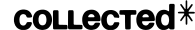

  <strong>Portfolio website template built on <a href="https://nextjs.org">Next.js</a></strong> 
  <strong>Headless CMS powered by <a href="https://sanity.io">Sanity.io</a></strong> 

----- 
----

# Shoutouts

Base structure and Sanity fetching logic is based on [template-nextjs-personal-website](https://github.com/sanity-io/template-nextjs-personal-website). This is a great starter template by Sanity which is highly influenced this template.

### Designed and developed

- [@danil-vladimirov](https://github.com/danil-vladimirov)

 

# License

### [MIT](LICENSE)

> [danilvladimirov.co.uk](https://danilvladimirov.co.uk) &nbsp;&middot;&nbsp;
> Github [@danil-vladimirov](https://github.com/danil-vladimirov) &nbsp;&middot;&nbsp;
> Instagram [@danilvladimirov](https://instagram.com/danilvladimirov)

[vercel-deploy]: https://vercel.com/new/clone?repository-url=https%3A%2F%2Fgithub.com%2Fdanil-vladimirov%2Fcollected-nextjs-portfolio-template&project-name=collected-nextjs-portfolio-template&repository-name=collected-nextjs-portfolio-template&demo-title=Collected+Portfolio+Template&demo-description=A+Sanity-powered+Nextjs+portfolio+website+with+built-in+content+editing.&demo-url=https%3A%2F%2Fcollected-nextjs-portfolio-template.vercel.app%2F&demo-image=https%3A%2F%2Fcdn.sanity.io%2Fimages%2Fkpvqqfux%2Fproduction%2Fda082b62d1828efe642c617ddc4771a4d267fc5e-3092x1790.png&integration-ids=oac_hb2LITYajhRQ0i4QznmKH7gx&external-id=nextjs%3Btemplate%3Dtemplate-nextjs-personal-website
[integration]: https://www.sanity.io/docs/vercel-integration
[nextjs]: https://github.com/vercel/next.js
[sanity-homepage]: https://www.sanity.io
[localhost-3000]: http://localhost:3000
[localhost-3000-studio]: http://localhost:3000/studio
